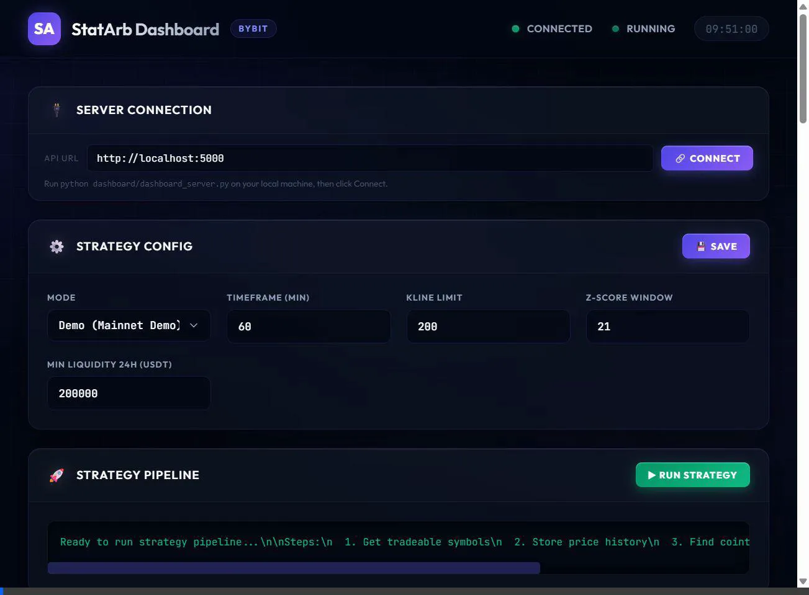

# StatArb Dashboard – Bybit 🚀

A professional, ultra-premium Statistical Arbitrage Trading Dashboard for Bybit. This project offers a robust backend for running complex quantitative trading strategies, execution logic, and an advanced real-time frontend dashboard.

 *(Imagine an ultra-premium dark theme dashboard here)*

## Architecture 🏛️

The system uses a **Hybrid Architecture**:
- **Frontend**: A static HTML/CSS/JS dashboard, locally hosted, designed with top-tier glassmorphism and real-time polling mechanisms.
- **Backend**: A local API server (`dashboard_server.py`) powered by Flask, handling all interaction with your file system (strategy config, execution bot running, data reads/writes).
- **Core Engine**: Python scripts in `strategy/` (mining statistically cointegrated pairs) and `execution/` (actively managing orders and stop-losses on Bybit via API).

## Setup & Installation ⚙️

### 1. Requirements

- Python 3.9+
- Bybit Account with API Keys

### 2. Initialization

Clone the repo and navigate into it:
```bash
git clone https://github.com/Tumiqa/stat_arb_bybit.git
cd stat_arb_bybit
```

Create and activate a virtual environment:

**Windows:**
```cmd
python -m venv venv
venv\Scripts\activate
```

**Mac/Linux:**
```bash
python3 -m venv venv
source venv/bin/activate
```

### 3. Install Dependencies

```bash
pip install -r requirements.txt
```

### 4. Configuration

Open `execution/config_execution_api.py` and input your Bybit API keys. **Never commit your keys to GitHub.**

## Running the Dashboard 🎯

You no longer need to run the `.py` files manually for the workflow. The dashboard acts as your master control panel.

1. **Start the Local Server:**
   ```bash
   python dashboard/dashboard_server.py
   ```
   *The server will run on `http://localhost:5000`.*

2. **Open the Dashboard:**
   Open your browser and navigate to `http://localhost:5000`. 

*(Do not use GitHub Pages for running the dashboard. The dashboard requires real-time access to the local Python subprocesses and CSV/JSON output data!)*

## Features ✨

- **Real-Time Log Streaming**: Watch exactly what the strategy and execution bot are doing without touching the terminal.
- **Liquidity Filters**: Filter out low-volume pairs dynamically (`MIN_TURNOVER_24H`).
- **Auto-Sync Execution**: When the pipeline finishes calculating cointegration, the best performing pair is automatically synced into the execution config.
- **Backtest Visualization**: Instantly view z-score mean reversions mapped on interactive charts.
- **1-Click Git Deploy**: Manage code pushes right from the UI.
- **Ultra-Premium UI**: Fully responsive, dark-mode focused, glassmorphic layout engineered for professional trading setups.

---
*Disclaimer: Use live mode trading at your own risk. Always thoroughly test strategies in Demo before committing real capital.*
